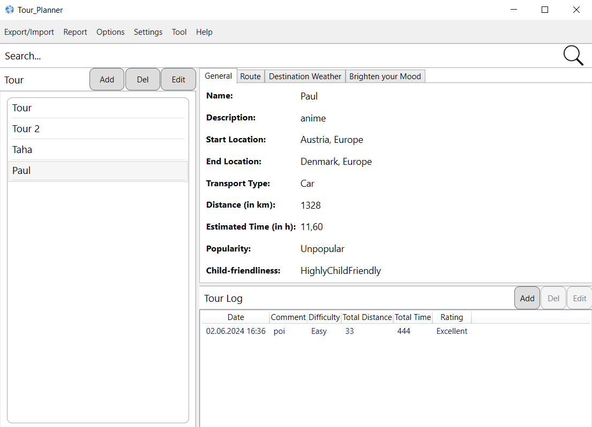
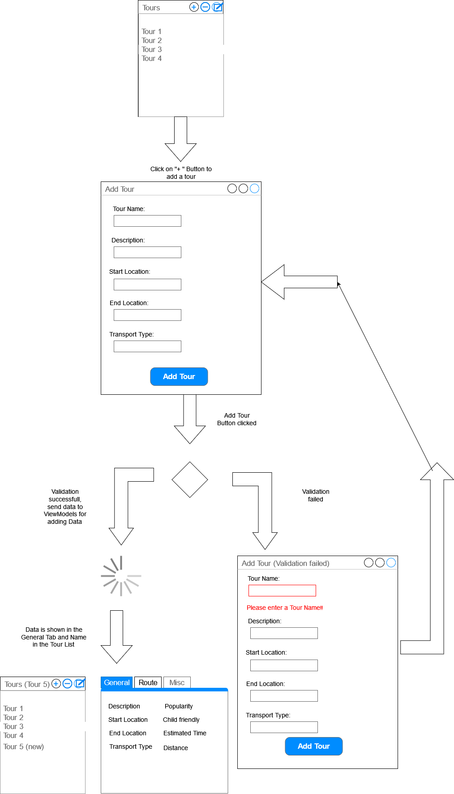
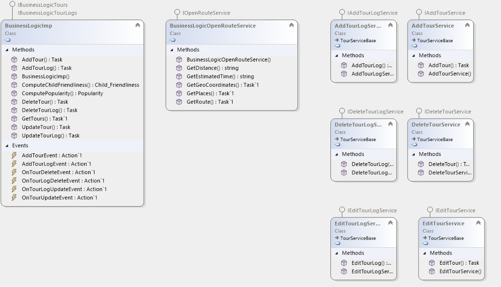
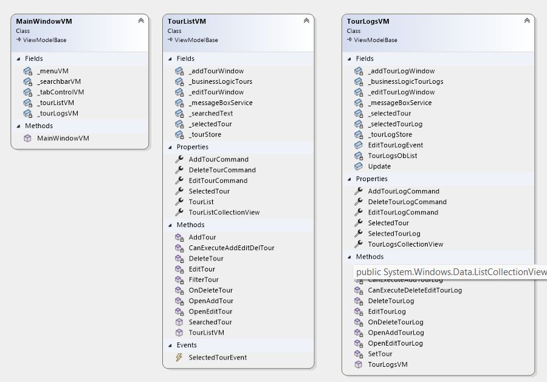
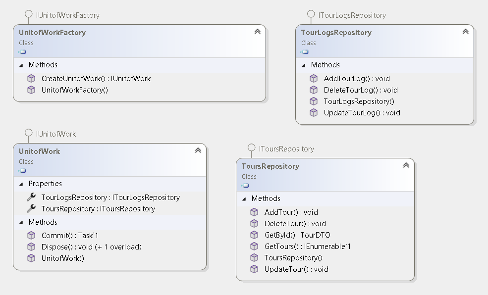
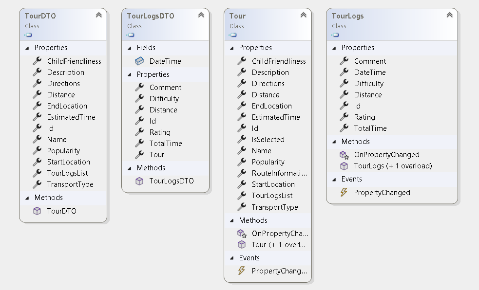
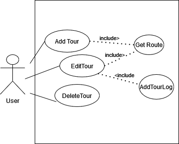
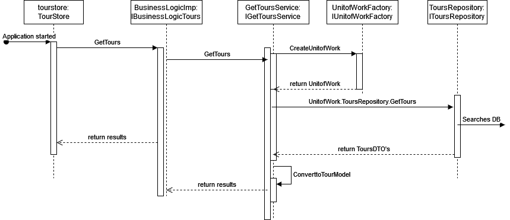

# 
Protocol

### Screenshot of User Interface

## Description of UI

On top of the Interface we have a search bar where the user can search for tours that are similar or for a specific
tour. Beneath that on the left side, we have the tour list. Here, the user can add, modify or delete a tour. For adding,
the user should klick the "add tour" button. For the other operations, there are buttons foreach tour in the list. A new
window pops up if the user decides to either add a tour or modify an existent tour. On the right side of the page, there
are three tabs. In the general tab, there is the tour information (Date, Start Location, End Location, ...). In the
route tab, there will be a map of the tour. Beneath those tabs, there are the tour logs for a specific tour. Here you
can also add, modify or delete a tour log. In the same way, new windows will pop up for adding or modifying a tour.

### Wiremock for Add tour operation

 
    

## Description of app architecture

We decided to layer this project in to three layers. The Presentation Layer is responsible for handling everything that
happens immediately with the user. It should give feedback to the user so that he known at any time in which state he is
currently on. Furhermore, this layer calls on layer below to the businesslayer for various tasks. Here, we have our
connection to the OpenRouteService API and the computing of our Popularity and Child friendliness (Computed Attributes).
Furthermore, for the CRUD operations that the user wants to fulfill for the Tours and TourLogs, the Businesslogic calls
Services that are still in the Businesslayer. Every operations has its own service. Before we call a UnitofWork in the
DAL layer, we convert our Model from the Frontend to a DTO that is saved in the Database. We do that because we have
code in our Tour and TourLog Models that are just for the frontend. As said before we now call a UnitofWork and that
gives us access to the repository. And in there, we now can execute the CRUD operation, that was requested from the
user, on the database.

### Class Diagram BL

### Class Diagram PL

### Class Diagram DAL

### Class Diagram DTO and Models

## Description of Use Cases

## Description of Use Cases

If we break it down, the user can activley do most of the CRUD operations. He can Add, Edit and Delete a tour as well as
Add, Edit and Delete a TourLog. But in the background they are not all just happening if the user wants to do them. For
example, at any operations with the Tourlogs(ADD, EDIT, DELETE) the Edit Tour case has to be done too because it effects
the content of the tour itself.

### Use Case Diagram(not all use cases depicted)

### SequenceDiagram(GetTours)

### Library Decicions / Lessons learned

We are using the libraries that we talked about in the course. The only one we use that we didnt talk about is for the
generic host. We use this because we had a lot of problems with Dependency Injection in general and because of that we
talked about it with other groups and most of them have used the generic host. Before that, we had the IoC Container but
in order to get the best help from colleagues, we thought it would be the best idea to make it that way.
What we have learned is that, DI can help you with a lot of things but can also make your program unusable. For example,
we had a lot of trouble injecting our database into our project. Because the AddDbContext function makes it a scoped
service, it cant be hold by a singelton and that ruined our hole application. Then we made a factory for the DBContext
but now we had the problem that the Respository and our UnitofWork didnt use the same Context and no operations could be
fulfilled. At the end we used the DBContextfactory from the Hostbuilder service and a factory for the unitofwork. The
only "problem" is that the UnitofWork Factory is directly dependent on the UnitofWork class.

## Implemented Design Patterns

As mentioned before, we implemented the factory pattern. One time for UnitofWork and a second time for our Logging.
Moreover, we implemented the MVVM pattern for our frontend.

## Unit Testing decision

The way we approached the unit tests might not be ideal, but it worked for us. We did the following: every time we have
a function that does not work the way is it was intended we did a unit test. As most our problems were inside
Viewmodels,
we have made many unit tests to solve these problems. There was however a problem in our service that we wanted to test,
which was the PdfReportGenerationService. Furthermore, we decided to use the FakeItEasy Framework to aid us making these
unit tests. Because it was our first time using this Framework or our first time using a mocking framework in general,
we
had a lot of difficulties mocking dependencies such the services in the BusinessLayer (openRouteService,
AddTourService...),
the Factories in the DataAccessLayer and the Repositories. Another Problem was that the way we solved our problem for
the
Dbcontext was very complicated. We had to use a UnitOfWorkFactory as well as IDbContextFactory<TourPlannerDbContext>.
The IDbContextFactory<> is from the Microsoft.EntityFrameworkCore namespace and can be used if we use
AddDbContextFactory instead of simply AddDbContext, and the latter did not work for us, so we had to use the former.
That made the mocking much more difficult than we expected, which why we completely gave up testing the DataAccessLayer.
That is another reason we
decided to mostly focus on Viewmodels and their most important functions and how they handle exception, whether they can
detect wrong input or not. Most of the test needed some kind of mocking, some more advanced than the other.

In conclusion, we decided to mostly test Viewmodels because the Businesslayer and DataAccessLayer were too hard to mock.
We tested whether the data needed for the most important functions in the viewmodel were valid, and if yes, we tested
its
core functionality, for example if the Tour or more are selected and the path to a folder is valid and the filename is
not empty too, the function GeneratePdfReport should work perfectly fine. So regarding testing Viewmodels we made sure
to
have the most important functions tested.

## Tracked time

In total, we came up to about 65 hours each.

### Link to GIT

    https://github.com/if22b151/Tour_Planner